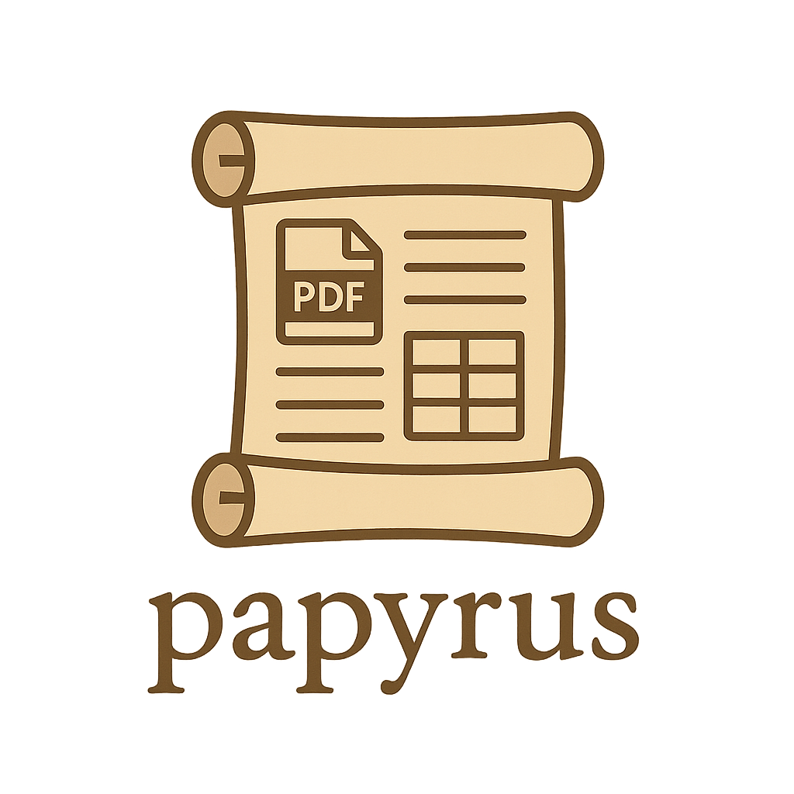

# papyrus
This library aims at extracting text and tables from pdf.

### Installation
You can install the library with
``` powershell
python -m pip install https://github.com/eurobios-mews-labs/papyrus.git
```

## Basic usage
1. Choose you extractor from engine.py
- engine.PDFPlumberExtractor()
- engine.DoclingExtractor()
- engine.PyMuPDFExtractor()
- engine.PyPDF2Extractor()
- engine.CamelotExtractor()

| Extractor               | extracting text | extract tables |
|:------------------------|:---------------:|---------------:|
| PDFPlumber              |        X        |              X |
| Docling                 |        X        |              X |
| PyMuPDFExtractor        |        X        |                |
| PyPDF2Extractor         |        X        |                |
| CamelotExtractor        |                 |              X |
  
2. Depending on the extractor chosen you can extract only text or only table or both.
The available extractors are [pdfplumber, pymupdf, pypdf2, camelot, docling]

````python
from papyrus.core import PapyrusExtractor

file_path = "invoice_100.pdf"
# instanciate PapyrusExtractor with a name of pdf plumber extractor from the list of available extractors
papyrus = PapyrusExtractor("pdfplumber")
#extract only text
text = papyrus.get_text(file_path)
#print the result
print(text)
#extract only tables
tables = papyrus.get_tables(file_path)
print(tables)
#extract both text and tables
text_tables = papyrus.get_all(file_path)
````

## Contributing

You are very welcome to contribute to the project, by requesting features,
pointing out new tools that can be added as component, by identifying issues and creating new features. 
Development guidelines will be detailed in near future.

* Fork the repository
* Clone your forked repository ```git clone https://github.com/$USER/papyrus.git```
* Test using pytest ````pip install pytest; pytest tests/````
* Submit you work with a pull request.

## Authors

Eurobios Mews Labs


